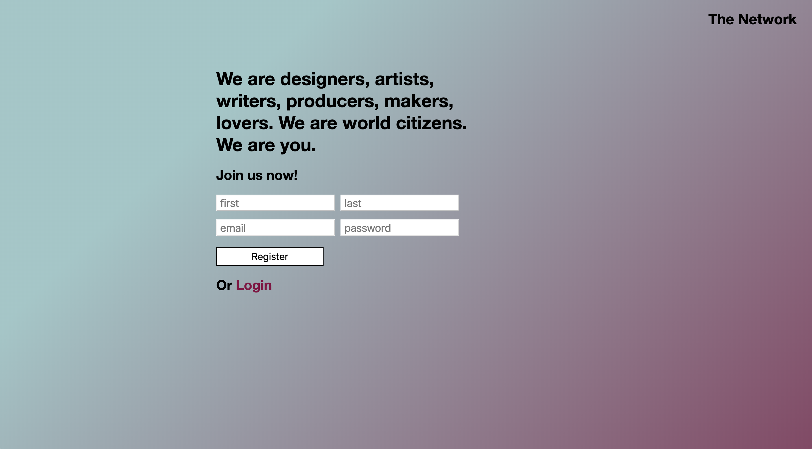
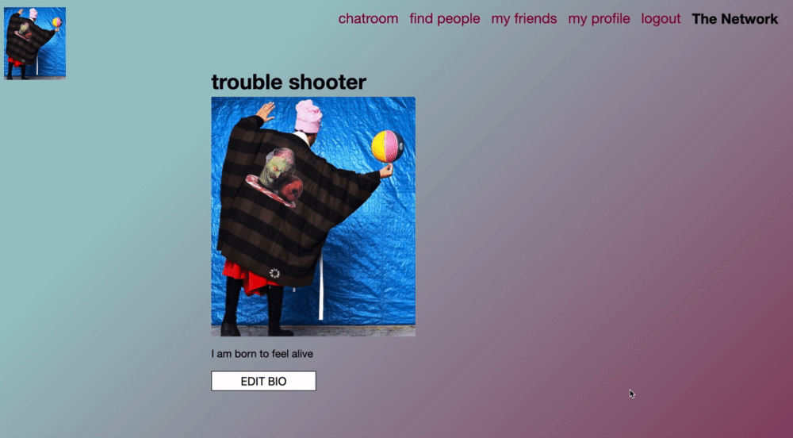
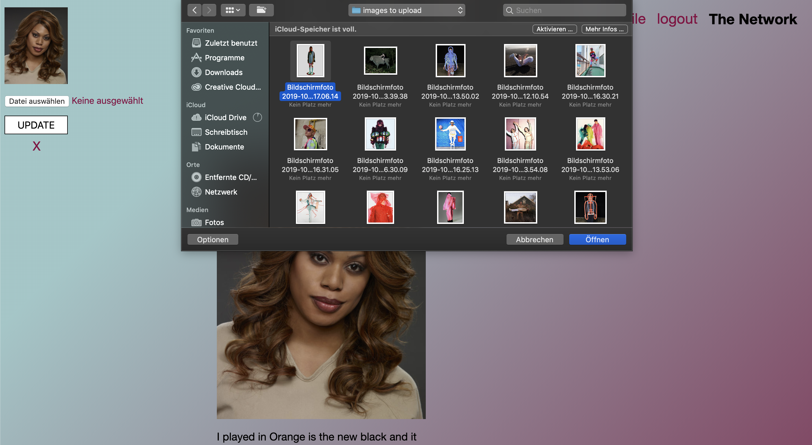
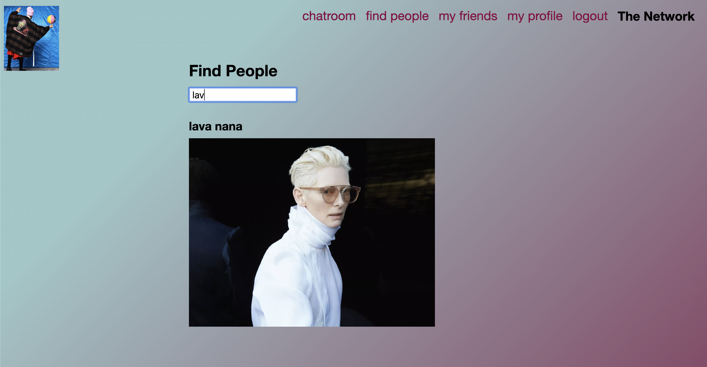
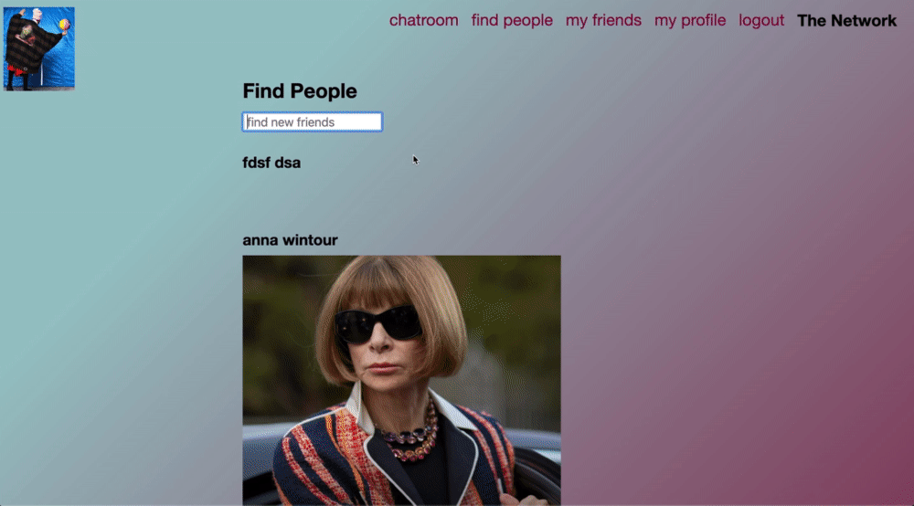
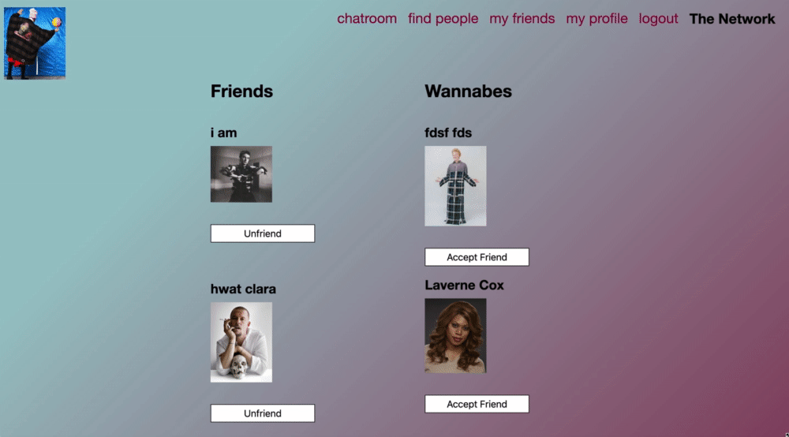
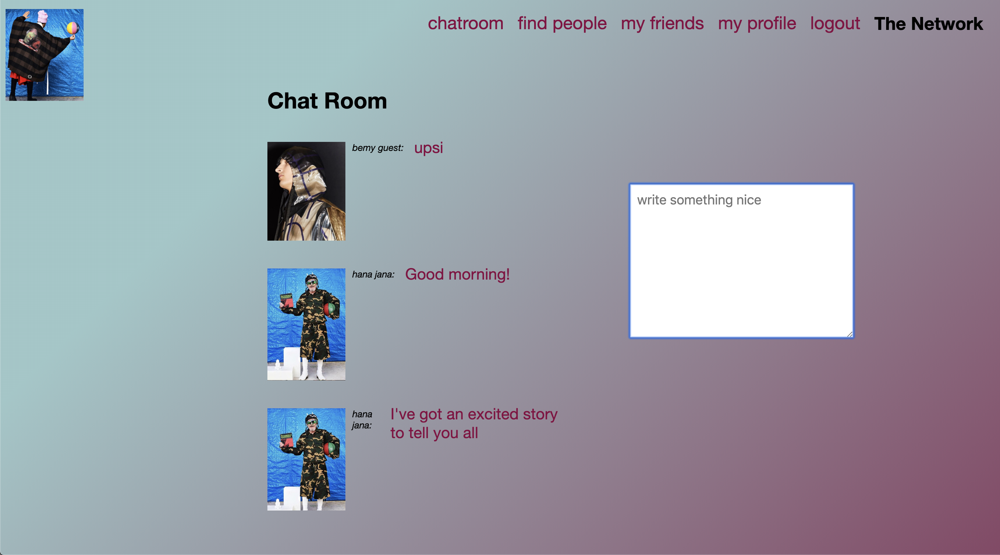

# Social Network

This site includes the basics of a social network. 
Everyone can be part of *The Network* by registering with a name, email and password.
The project was made during my training at SPICED Academy Berlin. They provided me with a package.json.

# Tech Stack

It's a single-page application made with:

* HTML, CSS, Javascript, React/React Hooks, Redux, Socket.IO, Node.js, Express, Bundle.js, AWS/S3, Multer, PostgreSQL

       Including a database with three tables:
              - Users with firstname, lastname, email, password, profile-image, biography
              - Friendships with receiver, sender, accepted
              - Chats with sender, message, posted-data

# Demo Social Network

### My Profile

On *my profile* users can upload their profile image and write their biography which both is always changeable.

### Find People

On *find people* users see recently joined users and they can find users by name, go to their profile pages and send friend requests which they're always able to cancel.

### My Friends

On *my friends* page users see their friends and who want to become their friends. They can accept friendships and also they're able to end the relation to friends. 

### Chat Room

In the *chatroom* users can write messages to other users that can answer directly in time.

Users can logout and login again at any time.
